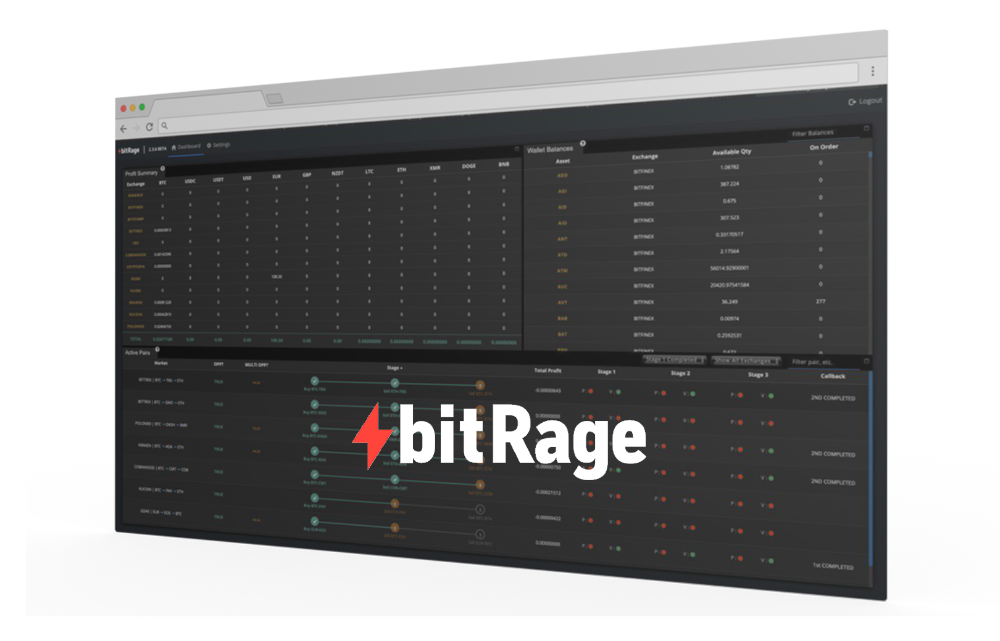

# Welcome to the bitRage wiki \(beta\)

tbd

## 










## Disclaimer

The information provided on this wiki does not constitute investment advice, financial advice, trading advice, or any other sort of advice, and you should not treat any of the wiki's content as such. bitRage does not recommend that any asset should be bought, sold, or held by you. Nothing on this website should be taken as an offer to buy, sell or hold a cryptocurrency. Do conduct your own due diligence and consult your financial advisory before making any investment decision. bitRage will not be held responsible for the investment decisions you make based on the information published on this wiki.


**Project origin:** [BitcoinTalk thread](https://bitcointalk.org/index.php?topic=1715214.0).

